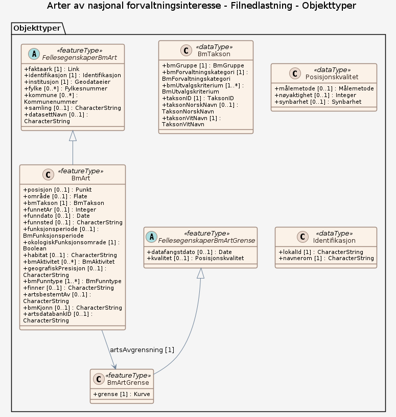

# Produktspesifikasjon: Arter av nasjonal forvaltningsinteresse

*Arter av nasjonal forvaltningsinteresse er et forvaltningsrettet datasett som distribueres av Miljødirektoratet, der datafangsten helt og fullt er basert på dataflyten for artsdata som er etablert av Artsdatabanken. Artsdatabanken har, siden etableringen i 2005, etablert dataflyt med relevante institusjoner og relevante databaser som blir synliggjort i Artskart. Eierskapet til data er avklart og ligger hos originalverten. 

Arter av nasjonal forvaltningsinteresse består både av arter som trenger beskyttelse og arter som er skadelige (fremmede). Alle relevante artsgrupper er omfattet. Beslutning om hvilke arter som inngår er i all hovedsak tatt i henhold til ulike relevante statuser som arter kan befinne seg i. Trua arter, ansvarsarter og freda arter er eksempler på slike statuser, som i datasettet er definert som utvalgskriterier. 

I tillegg til at det er besluttet hvilke arter som skal inngå, er det besluttet to kvalitetsparametere som må være utfylt eller som må fylle noen minstekrav; geografisk presisjon og funksjon (aktivitet). Disse kravene varierer mellom ulike artsgrupper. 

Kartlagte forekomster av sensitive funksjonsområder for gitte arter, dvs. forekomster som det ikke skal være allmenn tilgang til detaljert informasjon om, er ikke inkludert i dette datasettet.*

**Nøkkelord:** Biologisk mangfold, Arter, Norge, Svalbard, Jan Mayen, Artsfordeling, Inspire, geodataloven, Det offentlige kartgrunnlaget, Norge digitalt, ØkologiskGrunnkart, modellbaserteVegprosjekter, fellesDatakatalog, Natur

**Emnekategorier:** Biologisk mangfold

**Geografisk utstrekning**:

- **Vest**: 2.0
- **Øst**: 33.0
- **Sør**: 57.0
- **Nord**: 72.0

**Tidsmessig utstrekning**:

- **Tidsperiode**:
  - **Fra**: 2015-02-16
  - **Til**: 2021-01-01

## Om spesifikasjonen

> **Denne versjonen av produktspesifikasjonen:**  
> **Opprettet dato:** 2015-02-16 
> **Endret dato:** 2021-01-01 
> **Språk:** nor 
> **Kontaktinformasjon:** Miljødirektoratet, [post@miljodir.no](mailto:post@miljodir.no)

## Om produktet Arter av nasjonal forvaltningsinteresse

> **Romlig representasjonstype:** Vektor 
> **Unik identifikator:** <https://data.geonorge.no/sosi/artsmangfold/arter_nasjonal_forvaltning> 
> **Kontaktinformasjon:** Miljødirektoratet, [post@miljodir.no](mailto:post@miljodir.no)
>
> **Romlig oppløsning:**
>
> **Ekvivalent målestokk**: 1000
>
> **Begrensninger:**
>
> **Ressursbegrensninger**:
>
> - **Bruksbegrensninger**: Ingen begrensninger på bruk er oppgitt.
>
> **Juridiske begrensninger**:
>
> - **Tilgangsbegrensninger**: Åpne data
> - **Bruksbegrensninger**: Lisens
> - **Lisens**: Creative Commons BY 4.0 (CC BY 4.0)
> - **Lisenslenke**: <https://creativecommons.org/licenses/by/4.0/>
> - **Andre begrensninger**: Data i datasettet er linsensiert av Artsdatabanken. Miljødirektoratet publiserer data uten endringer, men med tilleggsegenskapene Forvaltningskategori og Utvalgskriterium. Ved bruk av data oppgis Artsdatabanken og Miljødirektoratet som kilde.
>
> **Sikkerhetsbegrensninger**:
>
> - **Klassifisering**: Ugradert

### Formål

Formålet med datasettet er å vise leveområder for arter av nasjonal forvaltningsinteresse, som det bør tas spesielt hensyn til i arealplanlegging, eller som det av andre årsaker er nyttig å ha kunnskap om (overvåking, bekjempelsesprosjekt for fremmede arter).

### Bruksområde

Datasettet gir verdifull informasjon til bruk bl.a. i den kommunale arealplanleggingen og annen planlegging av arealbruk. Samtidig gir datasettet føringer for hvilke arter som bør inngå i artskartlegging.

Datasettet egner seg for fremstilling av temakart, interaktive kart, kartløsninger på internett og til
geografiske analyser.

## Omfang

### Hele datasettet

**Nivå**: dataset

**Nivåbeskrivelse**: Gjelder hele datasettet. Hvis omfang ikke er oppgitt under en overskrift, gjelder teksten for hele datasettet og alle leveranser

### Filnedlastning

**Nivå**: dataset

**Nivåbeskrivelse**: Arter av nasjonal forvaltningsinteresse består både av arter som trenger beskyttelse og arter som er skadelige (fremmede)

## Datainnhold og struktur

### Datamodell - Filnedlastning

➡️ [Se full datamodell for omfang "Filnedlastning" (diagram per pakke og objektkatalog)](filnedlastning/objektkatalog.html)

## Referansesystem

| EPSG-kode | Navn på referansesystem |
| --- | --- |
| [EPSG:25833](https://epsg.io/25833) | [EUREF89 UTM sone 33, 2d](https://register.geonorge.no/epsg-koder) |

## Datakvalitet

**Nivå**: dataset

- **Kvalitetsmål**: COMMISSION REGULATION (EU) No 1089/2010 of 23 November 2010 implementing Directive 2007/2/EC of the European Parliament and of the Council as regards interoperability of spatial data sets and services
  **Målebeskrivelse**: Dataene er ikke iht produktspesifikasjonen
  **Beskrivende resultat**: Dataene er ikke iht produktspesifikasjonen

- **Kvalitetsmål**: SOSI-produktspesifikasjon: Arter av nasjonal forvaltningsinteresse
  **Målebeskrivelse**: Dataene er ikke vurdert iht produktspesifikasjonen
  **Beskrivende resultat**: Dataene er ikke vurdert iht produktspesifikasjonen

- **Kvalitetsmål**: Sosi applikasjonsskjema
  **Målebeskrivelse**: SOSI-filer er ikke vurdert i henhold til applikasjonsskjema
  **Beskrivende resultat**: SOSI-filer er ikke vurdert i henhold til applikasjonsskjema

- **Kvalitetsmål**: Sosi applikasjonsskjema
  **Målebeskrivelse**: GML-filer er ikke vurdert i henhold til applikasjonsskjema
  **Beskrivende resultat**: GML-filer er ikke vurdert i henhold til applikasjonsskjema

- **Kvalitetsmål**: Prosentvis oppfyllelse av FAIR-prinsipper
  **Målebeskrivelse**: Angir fullstendighet i forhold til krav fra FAIR-prinsippene (The FAIR Guiding Principles for scientific data management and stewardship)
  **Resultat**: 87

- **Kvalitetsmål**: FAIR
  **Resultat**: Prosentvis oppfyllelse av FAIR-prinsipper: 87%

## Datafangst og produksjon

**Datainnsamling og prosessering**:

- **Prosesstrinn**:
  - **Beskrivelse**: Data i dette datasettet hentes fra Artsdatabankens tjeneste Artskart. Artskart henter og formidler data fra et stort antall databaser i ulike institusjoner, og innholdet i datasettet Arter av nasjonal forvaltningsinteresse utgjør en liten del av det totale volumet i Artskart. Miljødirektoratet og Artsdatabanken har etablert en automatisert dataflyt via API utviklet av Artsdatabanken. Miljødirektoratets produksjonsdatabase oppdateres hvert døgn. Miljødirektoratet gjør ingen endringer i originaldata, men tilføyer egenskapene "Forvaltningskategori" og "Utvalgskriterium". Disse egenskapene tilordnes den enkelte art, slik at plassering i utvalgskriterium avgjør plassering i forvaltningskategori. Identiske observasjoner på en lokalitet blir ikke definert som unike poster, men aggregeres til et antall, med dato fra første observasjon til seneste observasjon. I faktaarkene er alle observasjoner av en art vist i en tabell, i henhold til Artsdatabankens datamodell. Datasettet har et stort antall dataeiere som kilde til originaldata. Artsdatabanken samler og formidler data gjennom Artskart og er distributør. Miljødirektoratet produserer datasettet ut fra nærmere definerte kriterier og formidler datasettet gjennom standardiserte tjenester (WMS, nedlasting). Egner seg til bruk i målestokk 1000-50000

## Vedlikehold

**Vedlikeholdsfrekvens**: Daglig

**Status**: Kontinuerlig oppdatert

## Presentasjon

**navn**: Tegneregler

**Lenke**:
<https://register.geonorge.no/register/versjoner/tegneregler/miljodirektoratet/arter-av-nasjonal-forvaltningsinteresse>

## Leveranse

| Tjeneste | Endepunkt | Type | Format | Leveranseenheter |
| --- | --- | --- | --- | --- |
| Geonorge nedlastning | [Lenke](https://geoapi.p.aks.miljodirektoratet.no/geonorge/capabilities/) | GEONORGE:DOWNLOAD | SOSI, FGDB, GML, GeoJSON | kommunevis, fylkesvis, landsfiler |
| REST-API | [Lenke](https://kart3.miljodirektoratet.no/arcgis/rest/services/artnasjonal3/MapServer) | W3C:REST | JSON | fylkesvis, landsfiler, kommunevis |
| Atom Feed | [Lenke](https://nedlasting.miljodirektoratet.no/miljodata/ATOM/Datasett/art_nasjonal.xml) | W3C:AtomFeed | FILEGDB, GML | kommunevis, fylkesvis, landsfiler |
| Arter av nasjonal forvaltningsinteresse 3 WMS | [Lenke](https://kart3.miljodirektoratet.no/arcgis/services/artnasjonal3/MapServer/WMSServer?request=GetCapabilities&service=WMS) | WMS-tjeneste | PNG |  |

## Metadata

**Metadatastandard**: ISO19115

**Metadatastandardversjon**: 2003

**Metadatadato**: 2026-05-22

**språk**: nor

**Kontakt**:

- **Organisasjon**: Miljødirektoratet
- **Kontaktperson**: Seksjon for kartlegging og geodata
- **Logo**: <https://register.geonorge.no/data/organizations/999601391_miljodirektoratet_liten.png>
- **Epost**: wms@miljodir.no
- **rolle**: pointOfContact

**Metadataidentifikator**:

- **Utsteder**: Geonorge
- **kode**: a8456aed-441a-40c4-831f-46bcbe4e6ff1
- **koderom**: <https://kartkatalog.geonorge.no/metadata/>
- **Metadatalenke**: <https://kartkatalog.geonorge.no/metadata/a8456aed-441a-40c4-831f-46bcbe4e6ff1>

## Tilleggsinformasjon

Datasettet inneholder: 

1. Verdsatte arter - alle - punkt: 
Kartlaget viser punktforekomster for arter som har en verdikategori 'Middels', 'Stor' eller 'Svært stor' verdi i henhold til Veileder M-1941 Konsekvensutredning av klima og miljø.

2. Verdsatte arter - alle - områder
Kartlaget viser områderforekomster for arter som har en verdikategori 'Middels', 'Stor' eller 'Svært stor' verdi i henhold til Veileder M-1941 Konsekvensutredning av klima og miljø.

3. Prioriterte arter - punkt
Kartlaget viser punktforekomster for arter som prioritert art etter egen forskrift.

4. Prioriterte arter - områder - Naturbase
Kartlaget viser områdeforekomster for arter som prioritert art etter egen forskrift. Disse områdene er deretter begrenset til de som er levert og delt via Miljødirektoratets Naturbase.

5. Prioriterte arter - områder - alle
Kartlaget viser områdeforekomster for arter som prioritert art etter egen forskrift.

6. Fredete arter - punkt
Kartlaget viser punktforekomster for arter som fredet etter egen forskrift.

7. Fredete arter - områder
Kartlaget viser områdeforekomster for arter som fredet etter egen forskrift.

8. Truede arter - punkt
Kartlaget viser punktforekomster for arter som er truet i henhold til Rødlista for arter.

9. Truede arter - områder
Kartlaget viser områderforekomster for arter som er truet i henhold til Rødlista for arter.

10. Ansvarsarter - punkt
Kartlaget viser punktforekomster for arter som er ansvarsarter (>25% av europeisk bestand i Norge).

11. Ansvarsarter - områder
Kartlaget viser områdeforekomster for arter som er ansvarsarter (>25% av europeisk bestand i Norge).

12. Konvensjonsarter - punkt
Kartlaget viser puntforekomster for arter som inngår i internasjonale konvensjoner vedtatt av Norge, synliggjøres her. Dette er aktuelt for Bern-, Bonn- og OSPAR-konvensjonen. Merk, da dette potensielt utgjør svært mye data så har man i kartet kun med arter som også inngår i kartlaget for verdsatte arter. For en full liste over alle konvensjonsarter, så henstilles til at en ser på artstabellene for Arter av nasjonal forvaltningsinteresse.

13. Konvensjonsarter - områder
Kartlaget viser områdeforekomster for arter som inngår i internasjonale konvensjoner vedtatt av Norge, synliggjøres her. Dette er aktuelt for Bern-, Bonn- og OSPAR-konvensjonen. Merk, da dette potensielt utgjør svært mye data så har man i kartet kun med arter som også inngår i kartlaget for verdsatte arter. For en full liste over alle konvensjonsarter, så henstilles til at en ser på artstabellene for Arter av nasjonal forvaltningsinteresse.

14. Fremmede arter - punkt
Kartlaget viser punktforekomster for fremmede arter i risikokategoriene 'Høy' og 'Svært høy' risiko.

15. Fremmede arter - områder
Kartlaget viser områdeforekomster for fremmede arter i risikokategoriene 'Høy' og 'Svært høy' risiko.
