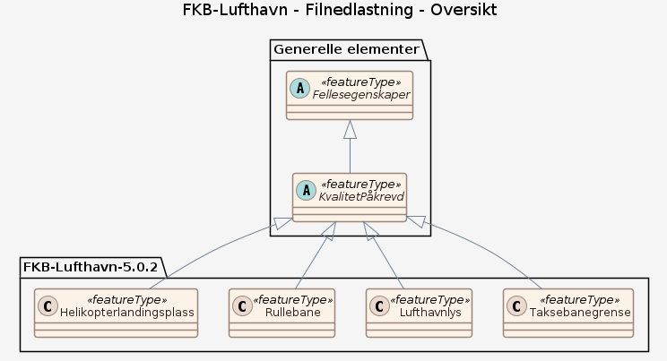

# Produktspesifikasjon: FKB-Lufthavn

*FKB-Lufthavn er en del av Felles Kartdatabase (FKB). FKB er en samling datasett som utgjør en sentral del av grunnkartet. Se metadataoppføring for Felles Kartdatabase for mer info.

FKB-Lufthavn omfatter et begrenset utvalg av objekttyper for lufthavner som skal registreres og forvaltes i FKB. Avinor har en mer detaljert spesifikasjon som benyttes for datafangst og forvaltning av data for Avinors egne lufthavner. Data etter denne spesifikasjonen skal kunne avledes fra Avinors data.

FKB-data er ikke-sensistive og åpne data. FKB-dataene er finansiert gjennom Geovekst-samarbeidet, eller kommunene alene for kommuner som står utenfor Geovekst. FKB-dataene er fritt tilgjengelige for Norge digitalt parter og kan lastes ned gjennom nedlastingsløsningen på Geonorge. Private aktører må kjøpe tilgang til dataene gjennom en forhandler.*

**Nøkkelord:** FKB, Basiskart, Grunnkart, Lufthavn, Norge, Nasjonalt, geodataloven, Norge digitalt, beredskapsbase, Det offentlige kartgrunnlaget, modellbaserteVegprosjekter, fellesDatakatalog, Basis geodata

**Emnekategorier:** Basisdata

**Geografisk utstrekning**:

- **Vest**: 4.56
- **Øst**: 33.67
- **Sør**: 57.47
- **Nord**: 70.85

**Tidsmessig utstrekning**:

- **Tidsperiode**:
  - **Fra**: 2017-01-15
  - **Til**: 2026-05-19

## Om spesifikasjonen

> **Denne versjonen av produktspesifikasjonen:**  
> **Opprettet dato:** 2017-01-15 
> **Endret dato:** 2026-05-19 
> **Språk:** nor 
> **Kontaktinformasjon:** Geovekst, [kundesenter@kartverket.no](mailto:kundesenter@kartverket.no)

## Om produktet FKB-Lufthavn

> **Romlig representasjonstype:** Vektor 
> **Unik identifikator:** 23dfcc33-fb04-4898-aa88-68b49c4bfea7 
> **Kontaktinformasjon:** Geovekst, [kundesenter@kartverket.no](mailto:kundesenter@kartverket.no)
>
> **Romlig oppløsning:**
>
> **Ekvivalent målestokk**: 500
>
> **Begrensninger:**
>
> **Ressursbegrensninger**:
>
> - **Bruksbegrensninger**: Nedlasting av data begrenset til Norge digitalt avtaleparter.
>
> **Juridiske begrensninger**:
>
> - **Tilgangsbegrensninger**: Norge digitalt begrenset
> - **Bruksbegrensninger**: Lisens
> - **Lisens**: Norge digitalt-lisens
> - **Lisenslenke**: <https://www.kartverket.no/geodataarbeid/norge-digitalt/partsinformasjon/avtaler-og-vilkar/norge-digitalt-lisens>
>
> **Sikkerhetsbegrensninger**:
>
> - **Klassifisering**: Ugradert

### Formål

FKB er grunnleggende geografisk informasjon for å utøve lov- og forskriftsbelagte saker og ta gode beslutninger.

### Bruksområde

FKB kan brukes til:
- å kjenne seg igjen ute i terrenget
- forvaltningsmessig saksbehandling i kommuner, statlige etater og ledningsetater
- saksbehandling knyttet til plan- og bygningsloven med forskrifter
- prosjekteringsformål
- analyse og presentasjon i et integrert informasjonssystem (GIS-system)
- produksjon av kart og avledede produkter med forskjellig krav til innhold, detaljering og stedfestingsnøyaktighet

## Omfang

### Hele datasettet

**Nivå**: dataset

**Nivåbeskrivelse**: Gjelder hele datasettet. Hvis omfang ikke er oppgitt under en overskrift, gjelder teksten for hele datasettet og alle leveranser

### Filnedlastning

**Nivå**: dataset

**Nivåbeskrivelse**: FKB-Lufthavn omfatter et begrenset utvalg av objekttyper for lufthavner som skal registreres og forvaltes i FKB

## Datainnhold og struktur

### Datamodell - Filnedlastning

➡️ [Se full datamodell for omfang "Filnedlastning" (diagram per pakke og objektkatalog)](filnedlastning/objektkatalog.html)

## Referansesystem

| EPSG-kode | Navn på referansesystem |
| --- | --- |
| [EPSG:5972](https://epsg.io/5972) | [EUREF89 UTM sone 32, 2d + NN2000](https://register.geonorge.no/epsg-koder) |
| [EPSG:5973](https://epsg.io/5973) | [EUREF89 UTM sone 33, 2d + NN2000](https://register.geonorge.no/epsg-koder) |
| [EPSG:5975](https://epsg.io/5975) | [EUREF89 UTM sone 35, 2d + NN2000](https://register.geonorge.no/epsg-koder) |

## Datakvalitet

**Nivå**: dataset

- **Kvalitetsmål**: SOSI-produktspesifikasjon: FKB Lufthavn
  **Målebeskrivelse**: Dataene er i henhold til produktspesifikasjonen
  **Beskrivende resultat**: Dataene er i henhold til produktspesifikasjonen

- **Kvalitetsmål**: Sosi applikasjonsskjema
  **Målebeskrivelse**: SOSI-filer er i henhold til applikasjonsskjema
  **Beskrivende resultat**: SOSI-filer er i henhold til applikasjonsskjema

- **Kvalitetsmål**: Sosi applikasjonsskjema
  **Målebeskrivelse**: GML-filer er i henhold til applikasjonsskjema
  **Beskrivende resultat**: GML-filer er i henhold til applikasjonsskjema

- **Kvalitetsmål**: Prosentvis oppfyllelse av FAIR-prinsipper
  **Målebeskrivelse**: Angir fullstendighet i forhold til krav fra FAIR-prinsippene (The FAIR Guiding Principles for scientific data management and stewardship)
  **Resultat**: 95

- **Kvalitetsmål**: Prosentvis dekning i forhold til datasettets utstrekning
  **Målebeskrivelse**: Datasettets faktiske kartlagte areal i forhold til datasettets spesifiserte utstrekning
  **Resultat**: 90

- **Kvalitetsmål**: Prosentvis oppfyllelse av FAIR-prinsipper
  **Målebeskrivelse**: Angir fullstendighet i forhold til krav fra FAIR-prinsippene (The FAIR Guiding Principles for scientific data management and stewardship)
  **Resultat**: 95

- **Kvalitetsmål**: FAIR
  **Resultat**: Prosentvis oppfyllelse av FAIR-prinsipper: 95%

- **Kvalitetsmål**: Coverage
  **Resultat**: Prosentvis dekning i forhold til datasettets utstrekning: 90%

## Datafangst og produksjon

**Datainnsamling og prosessering**:

- **Prosesstrinn**:
  - **Beskrivelse**: Dataene har stort sett fotogrammetri (flybilder) som datakilde. Dataene ajourføres fotogrammetrisk gjennom Geovekst-kartleggingsprosjekter. FKB-data vedlikeholdes også kontinuerlig av Geovekstpartene gjennom Geovekst-forvaltningsavtaler. Her vil datakildene være landmåling, eller digitalisering fra planer eller ortofoto.

## Vedlikehold

**Vedlikeholdsfrekvens**: Kontinuerlig

**Status**: Kontinuerlig oppdatert

## Presentasjon

**navn**: Tegneregler

**Lenke**:
<https://register.geonorge.no/tegneregler/spesifikasjon-for-skjermkartografi>

## Leveranse

| Tjeneste | Endepunkt | Type | Format | Leveranseenheter |
| --- | --- | --- | --- | --- |
| Geonorge nedlastning | [Lenke](https://nedlasting.geonorge.no/api/capabilities/) | GEONORGE:DOWNLOAD | FGDB, GML, SOSI | fylkesvis, kommunevis, landsfiler |
| Atom Feed | [Lenke](http://nedlasting.geonorge.no/geonorge/ATOM-feeds/FKB-Lufthavn_AtomFeedFGDB.xml) | W3C:AtomFeed | FGDB | fylkesvis, kommunevis, landsfiler |
| Atom Feed | [Lenke](http://nedlasting.geonorge.no/geonorge/ATOM-feeds/FKB-Lufthavn_AtomFeedGML.xml) | W3C:AtomFeed | GML | fylkesvis, kommunevis, landsfiler |
| Atom Feed | [Lenke](http://nedlasting.geonorge.no/geonorge/ATOM-feeds/FKB-Lufthavn_AtomFeedSOSI.xml) | W3C:AtomFeed | SOSI | fylkesvis, kommunevis, landsfiler |
| FKB WMS | [Lenke](https://wms.geonorge.no/skwms1/wms.fkb?service=wms&request=getcapabilities) | WMS-tjeneste | png |  |

## Metadata

**Metadatastandard**: ISO19115

**Metadatastandardversjon**: 2003

**Metadatadato**: 2026-05-22

**språk**: nor

**Kontakt**:

- **Organisasjon**: Kartverket
- **Kontaktperson**: Nils Ivar Nes
- **Logo**: <https://register.geonorge.no/data/organizations/_geovekst_liten.png>
- **Epost**: kundesenter@kartverket.no
- **rolle**: pointOfContact

**Metadataidentifikator**:

- **Utsteder**: Geonorge
- **kode**: 23dfcc33-fb04-4898-aa88-68b49c4bfea7
- **koderom**: <https://kartkatalog.geonorge.no/metadata/>
- **Metadatalenke**: <https://kartkatalog.geonorge.no/metadata/23dfcc33-fb04-4898-aa88-68b49c4bfea7>

## Tilleggsinformasjon

FKB-data er spesifisert i fire standarder (FKB-A, FKB-B, FKB-C og FKB-D). FKB-A er mest detaljert og FKB-D er minst detaljert. Områdedekning for FKB-standardene finnes på forvaltningsinformasjon.geonorge.no 
I FKB finnes kvalitetskoding på det enkelte kartobjekt som angir dette objektets målemetode og antatte nøyaktighet. En oversikt over alder og kvalitet på dataene finnes på forvaltningsinformasjon.geonorge.no
