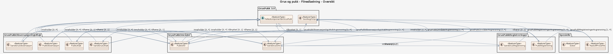

# Produktspesifikasjon: Grus og pukk

*Grus- og Pukkdatabasen ved NGU inneholder opplysninger om de aller fleste grus- og pukkforekomster og uttakssteder i Norge for utnyttelse som råstoff for bygge- og anleggsvirksomhet. Databasen gir også informasjon om arealbruk, volum, kvalitet og hvor viktige ressursene er som råstoff til byggetekniske formål.*

**Nøkkelord:** Byggeråstoffer, Geologi, Grus, Løsmasser, Pukk, Ressurs, Sand, Steinindustri, Norge, Mineralressurser, Inspire, Det offentlige kartgrunnlaget, Norge digitalt, geodataloven, dataNorgeNo, modellbaserteVegprosjekter, fellesDatakatalog

**Emnekategorier:** Geovitenskapelig informasjon

**Tidsmessig utstrekning**:

- **Tidsperiode**:
  - **Fra**: 2000-09-05
  - **Til**: 2026-05-18

## Om spesifikasjonen

> **Denne versjonen av produktspesifikasjonen:**  
> **Opprettet dato:** 2000-09-05 
> **Endret dato:** 2026-05-18 
> **Språk:** nor 
> **Kontaktinformasjon:** Norges geologiske undersøkelse, [ressursdatabaser@ngu.no](mailto:ressursdatabaser@ngu.no)

## Om produktet Grus og pukk

> **Romlig representasjonstype:** Vektor 
> **Unik identifikator:** <https://data.geonorge.no/sosi/geologi/grus_pukk> 
> **Kontaktinformasjon:** Norges geologiske undersøkelse, [ressursdatabaser@ngu.no](mailto:ressursdatabaser@ngu.no)
>
> **Romlig oppløsning:**
>
> **Ekvivalent målestokk**: 20000
>
> **Begrensninger:**
>
> **Ressursbegrensninger**:
>
> - **Bruksbegrensninger**: Anbefalt bruksmålestokk er 1:50.000. Der ØK var tilgjengelig ble imidlertid dataene etablert i 1:20.000-1:5000.
>
> **Juridiske begrensninger**:
>
> - **Tilgangsbegrensninger**: Åpne data
> - **Bruksbegrensninger**: Lisens
> - **Lisens**: Norsk lisens for offentlige data (NLOD)
> - **Lisenslenke**: <http://data.norge.no/nlod/no/1.0>
> - **Andre begrensninger**: Ingen begrensninger oppgitt.
>
> **Sikkerhetsbegrensninger**:
>
> - **Klassifisering**: Ugradert

### Formål

Målsetningen med Grus-, pukk- og steintippdatabasen er å gi informasjon om forekomster av sand, grus og pukk til byggeformål, og være et redskap i lokal og regional forvaltning for å sikre tilgangen av disse ressursene  i et langsiktig perspektiv.

### Bruksområde

Datasettet gir en oversikt over sand-, grus-, pukk- og steintippforekomster og uttakssteder i Norge som kan utnyttes som råstoff i bygge- og anleggsvirksomhet. En av nytteverdiene er å sikre at områder for eksisterende og fremtidig uttak av grus og pukk blir tatt med i kommunale arealplaner. Arealavgrensning av grus- og pukkforekomster er primært tiltenkt som støtte for kommunal arealplanlegging, og for næringsinteressenter  som har behov for å etablere nye uttak.

## Omfang

### Hele datasettet

**Nivå**: dataset

**Nivåbeskrivelse**: Gjelder hele datasettet. Hvis omfang ikke er oppgitt under en overskrift, gjelder teksten for hele datasettet og alle leveranser

### Filnedlastning

**Nivå**: dataset

**Nivåbeskrivelse**: Datasettet gir en oversikt over sand-, grus-, pukk- og steintippforekomster og uttakssteder i Norge som kan utnyttes som råstoff i bygge- og anleggsvirksomhet

## Datainnhold og struktur

### Datamodell - Filnedlastning

➡️ [Se full datamodell for omfang "Filnedlastning" (diagram per pakke og objektkatalog)](filnedlastning/objektkatalog.html)

## Referansesystem

| EPSG-kode | Navn på referansesystem |
| --- | --- |
| [EPSG:4258](https://epsg.io/4258) | [EUREF 89 Geografisk (ETRS 89) 2d](https://register.geonorge.no/epsg-koder) |
| [EPSG:25832](https://epsg.io/25832) | [EUREF89 UTM sone 32, 2d](https://register.geonorge.no/epsg-koder) |
| [EPSG:25833](https://epsg.io/25833) | [EUREF89 UTM sone 33, 2d](https://register.geonorge.no/epsg-koder) |
| [EPSG:25835](https://epsg.io/25835) | [EUREF89 UTM sone 35, 2d](https://register.geonorge.no/epsg-koder) |

## Datakvalitet

**Nivå**: dataset

- **Kvalitetsmål**: COMMISSION REGULATION (EU) No 1089/2010 of 23 November 2010 implementing Directive 2007/2/EC of the European Parliament and of the Council as regards interoperability of spatial data sets and services
  **Målebeskrivelse**: Dataene er ikke vurdert iht produktspesifikasjonen
  **Beskrivende resultat**: Dataene er ikke vurdert iht produktspesifikasjonen

- **Kvalitetsmål**: SOSI produktspesifikasjon: Grus og pukk
  **Målebeskrivelse**: Dataene er i henhold til produktspesifikasjonen
  **Beskrivende resultat**: Dataene er i henhold til produktspesifikasjonen

- **Kvalitetsmål**: Sosi applikasjonsskjema
  **Målebeskrivelse**: SOSI-filer er i henhold til applikasjonsskjema
  **Beskrivende resultat**: SOSI-filer er i henhold til applikasjonsskjema

- **Kvalitetsmål**: Prosentvis oppfyllelse av FAIR-prinsipper
  **Målebeskrivelse**: Angir fullstendighet i forhold til krav fra FAIR-prinsippene (The FAIR Guiding Principles for scientific data management and stewardship)
  **Resultat**: 93

- **Kvalitetsmål**: FAIR
  **Resultat**: Prosentvis oppfyllelse av FAIR-prinsipper: 93%

## Datafangst og produksjon

**Datainnsamling og prosessering**:

- **Prosesstrinn**:
  - **Beskrivelse**: Registrert på feltkart under feltundersøkelser. Omriss og punkter er borddigitalisert i FYSAK. Nyere punktregistreringer kan være stedfestet med GPS. Utplukksprogram fra Oracle-databasen. Kontroll utført i ArcGIS.

## Vedlikehold

**Vedlikeholdsfrekvens**: Etter behov

**Status**: Kontinuerlig oppdatert

## Presentasjon

**navn**: Tegneregler

**Lenke**:
<https://register.geonorge.no/register/versjoner/tegneregler/norges-geologiske-undersøkelse/grus-og-pukk>

## Leveranse

| Tjeneste | Endepunkt | Type | Format | Leveranseenheter |
| --- | --- | --- | --- | --- |
| Geonorge nedlastning | [Lenke](https://nedlasting.ngu.no/api/capabilities/) | GEONORGE:DOWNLOAD | FGDB, Shape, SOSI | landsfiler, fylkesvis |
| Egen nedlastningsside | [Lenke](https://geo.ngu.no/download/order?dataset=800) | WWW:DOWNLOAD-1.0-http--download | FGDB, Shape, SOSI | landsfiler, kommunevis |
| Atom Feed | [Lenke](https://nedlasting.ngu.no/api/atom/a26e57bc-15bd-46db-8504-6c6ed1e7c501) | W3C:AtomFeed | FGDB, Shape, SOSI, MS_EXCEL | landsfiler, fylkesvis |
| Grus og pukk WMS | [Lenke](https://geo.ngu.no/mapserver/GrusPukkWMS5?request=GetCapabilities&service=WMS) | WMS-tjeneste | WMS-tjeneste |  |

## Metadata

**Metadatastandard**: ISO19115

**Metadatastandardversjon**: 2003

**Metadatadato**: 2026-05-22

**språk**: nor

**Kontakt**:

- **Organisasjon**: Norges geologiske undersøkelse
- **Kontaktperson**: Janne Grete Wesche
- **Logo**: <https://register.geonorge.no/data/organizations/970188290_NGU_hovedlogo_svart.svg> thumbnail.png
- **Epost**: metadataansvarlig@ngu.no
- **rolle**: pointOfContact

**Metadataidentifikator**:

- **Utsteder**: Geonorge
- **kode**: a26e57bc-15bd-46db-8504-6c6ed1e7c501
- **koderom**: <https://kartkatalog.geonorge.no/metadata/>
- **Metadatalenke**: <https://kartkatalog.geonorge.no/metadata/a26e57bc-15bd-46db-8504-6c6ed1e7c501>

