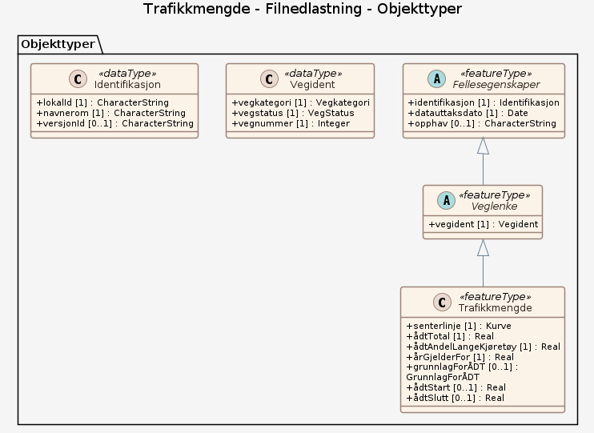

# Produktspesifikasjon: Trafikkmengde

*Datasettet gir informasjon om representativ trafikkmengde for en vegstrekning på europa-, riks- eller fylkesveger. Trafikkmengden er beregnet gjennom trafikkdatasystemet, men kan også unntaksvis være subjektivt anslått. Det utgis som et årsdatasett og er sentralt i forvaltning av vegene. Vegnett som har oppstått etter årets ÅDT-beregninger vil kunne mangle data frem til neste års ÅDT-beregning. Datagrunnlaget for ÅDT-beregninger er data fra individuelle målepunkt på vegnettet (trafikkregistreringsstasjoner), disse finnes på <http://trafikkdata.no*>

**Nøkkelord:** Trafikkmengde, Trafikkdata, Veginformasjon, ÅDT, samferdsel, Norge fastland, geodataloven, Det offentlige kartgrunnlaget, Norge digitalt, fellesDatakatalog

**Emnekategorier:** Transport

**Geografisk utstrekning**:

- **Vest**: 2.0
- **Øst**: 33.0
- **Sør**: 57.0
- **Nord**: 72.0

**Tidsmessig utstrekning**:

- **Tidsperiode**:
  - **Fra**: 2016-02-03
  - **Til**: 2026-01-01

## Om spesifikasjonen

> **Denne versjonen av produktspesifikasjonen:**  
> **Opprettet dato:** 2016-02-03 
> **Endret dato:** 2026-01-01 
> **Språk:** nor 
> **Kontaktinformasjon:** Statens vegvesen, [jan.kristian.jensen@vegvesen.no](mailto:jan.kristian.jensen@vegvesen.no)

## Om produktet Trafikkmengde

> **Romlig representasjonstype:** Vektor 
> **Unik identifikator:** <https://data.geonorge.no/sosi/samferdsel/trafikkmengde> 
> **Kontaktinformasjon:** Statens vegvesen, [jan.kristian.jensen@vegvesen.no](mailto:jan.kristian.jensen@vegvesen.no)
>
> **Romlig oppløsning:**
>
> **Ekvivalent målestokk**: 5000
>
> **Begrensninger:**
>
> **Ressursbegrensninger**:
>
> - **Bruksbegrensninger**: Ingen begrensninger på bruk er oppgitt.
>
> **Juridiske begrensninger**:
>
> - **Tilgangsbegrensninger**: Åpne data
> - **Bruksbegrensninger**: Lisens
> - **Lisens**: Norsk lisens for offentlige data (NLOD)
> - **Lisenslenke**: <http://data.norge.no/nlod/no/1.0>
> - **Andre begrensninger**: Ingen begrensninger oppgitt.
>
> **Sikkerhetsbegrensninger**:
>
> - **Klassifisering**: Ugradert

### Formål

Gir informasjon om representativ trafikkmengde for en trafikkstrekning. Kan brukes som grunnlag for ulike analyser der trafikkdata er relevant.

### Bruksområde

Trafikkanalyser, planlegging av veger og andre trafikksikkerhetstiltak, trafikkstøy m.m.

## Omfang

### Hele datasettet

**Nivå**: dataset

**Nivåbeskrivelse**: Gjelder hele datasettet. Hvis omfang ikke er oppgitt under en overskrift, gjelder teksten for hele datasettet og alle leveranser

### Filnedlastning

**Nivå**: dataset

**Nivåbeskrivelse**: Trafikkanalyser, planlegging av veger og andre trafikksikkerhetstiltak, trafikkstøy m.m.

## Datainnhold og struktur

### Datamodell - Filnedlastning

➡️ [Se full datamodell for omfang "Filnedlastning" (diagram per pakke og objektkatalog)](filnedlastning/objektkatalog.html)

## Referansesystem

| EPSG-kode | Navn på referansesystem |
| --- | --- |
| [EPSG:25832](https://epsg.io/25832) | [EUREF89 UTM sone 32, 2d](https://register.geonorge.no/epsg-koder) |
| [EPSG:25833](https://epsg.io/25833) | [EUREF89 UTM sone 33, 2d](https://register.geonorge.no/epsg-koder) |
| [EPSG:25835](https://epsg.io/25835) | [EUREF89 UTM sone 35, 2d](https://register.geonorge.no/epsg-koder) |
| [EPSG:3035](https://epsg.io/3035) | [EUREF89 / ETRS89-LAEA Europe](https://register.geonorge.no/epsg-koder) |
| [EPSG:4258](https://epsg.io/4258) | [EUREF 89 Geografisk (ETRS 89) 2d](https://register.geonorge.no/epsg-koder) |

## Datakvalitet

**Nivå**: dataset

- **Kvalitetsmål**: SOSI-produktspesifikasjon: Trafikkmengde
  **Målebeskrivelse**: Dataene er i henhold til produktspesifikasjonen
  **Beskrivende resultat**: Dataene er i henhold til produktspesifikasjonen

- **Kvalitetsmål**: Sosi applikasjonsskjema
  **Målebeskrivelse**: SOSI-filer er i henhold til applikasjonsskjema
  **Beskrivende resultat**: SOSI-filer er i henhold til applikasjonsskjema

- **Kvalitetsmål**: Sosi applikasjonsskjema
  **Målebeskrivelse**: GML-filer er i henhold til applikasjonsskjema
  **Beskrivende resultat**: GML-filer er i henhold til applikasjonsskjema

- **Kvalitetsmål**: Prosentvis oppfyllelse av FAIR-prinsipper
  **Målebeskrivelse**: Angir fullstendighet i forhold til krav fra FAIR-prinsippene (The FAIR Guiding Principles for scientific data management and stewardship)
  **Resultat**: 91

- **Kvalitetsmål**: FAIR
  **Resultat**: Prosentvis oppfyllelse av FAIR-prinsipper: 91%

## Vedlikehold

**Vedlikeholdsfrekvens**: Årlig

**Status**: Fullført

## Presentasjon

**navn**: Tegneregler

**Lenke**:
<https://register.geonorge.no/register/versjoner/tegneregler/statens-vegvesen/trafikkmengde>

## Leveranse

| Tjeneste | Endepunkt | Type | Format | Leveranseenheter |
| --- | --- | --- | --- | --- |
| Geonorge nedlastning | [Lenke](https://nedlasting.geonorge.no/api/capabilities/) | GEONORGE:DOWNLOAD | FGDB, GML, SOSI | fylkesvis, kommunevis, landsfiler |
| Atom Feed | [Lenke](http://nedlasting.geonorge.no/geonorge/ATOM-feeds/Trafikkmengde_AtomFeedFGDB.xml) | W3C:AtomFeed | FGDB | fylkesvis, kommunevis, landsfiler |
| Atom Feed | [Lenke](http://nedlasting.geonorge.no/geonorge/ATOM-feeds/Trafikkmengde_AtomFeedGML.xml) | W3C:AtomFeed | GML | fylkesvis, kommunevis, landsfiler |
| Atom Feed | [Lenke](http://nedlasting.geonorge.no/geonorge/ATOM-feeds/Trafikkmengde_AtomFeedSOSI.xml) | W3C:AtomFeed | SOSI | fylkesvis, kommunevis, landsfiler |

## Metadata

**Metadatastandard**: ISO19115

**Metadatastandardversjon**: 2003

**Metadatadato**: 2026-05-22

**språk**: nor

**Kontakt**:

- **Organisasjon**: Statens vegvesen
- **Kontaktperson**: Espen Sveen
- **Logo**: <https://register.geonorge.no/data/organizations/971032081_Statensvegvesen_liten.png>
- **Epost**: espen.sveen@vegvesen.no
- **rolle**: pointOfContact

**Metadataidentifikator**:

- **Utsteder**: Geonorge
- **kode**: af2c4a0a-1978-4e62-b08d-ed1f36bd5023
- **koderom**: <https://kartkatalog.geonorge.no/metadata/>
- **Metadatalenke**: <https://kartkatalog.geonorge.no/metadata/af2c4a0a-1978-4e62-b08d-ed1f36bd5023>

## Tilleggsinformasjon

Nasjonal vegdatabank (NVDB) tilbyr samkjøring av data fra mange kilder. Samkjøringen tillater at veg- og trafikkdata kan presenteres på kartbakgrunn og analyseres sammen med data fra andre etater. Statens vegvesen er kjent med at kvaliteten på data som tilbys gjennom samkjøringen kan være varierende. Det arbeides kontinuerlig med kvalitetsforbedring og oppdatering av datagrunnlaget. Statens vegvesen kan derfor ikke garantere at datagrunnlaget til enhver tid er riktig og således heller ikke på ta seg ansvar for resultater som skyldes feil i datagrunnlaget. 

Statens vegvesen har ikke noe ansvar for nøyaktighet, pålitelighet, eller fullstendighet for informasjon og kart tilgjengeliggjort. Statens vegvesen har heller ikke noe ansvar for følgeskader som skyldes bruk av informasjonen eller tekniske avbrudd i tjenesten.
